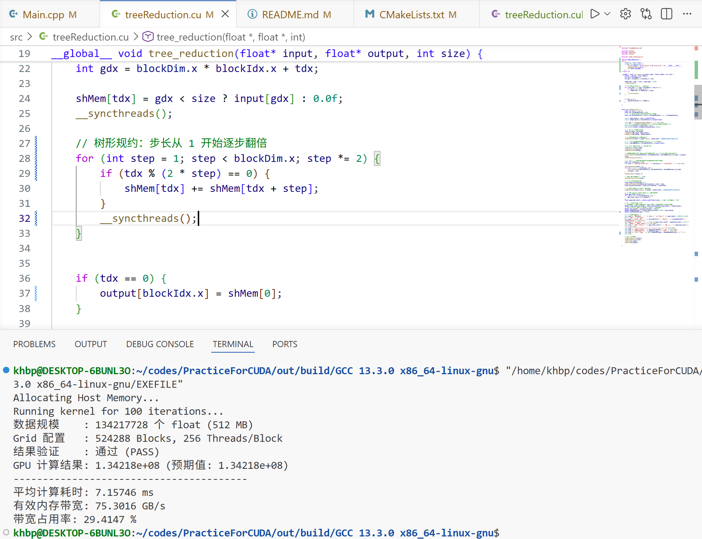
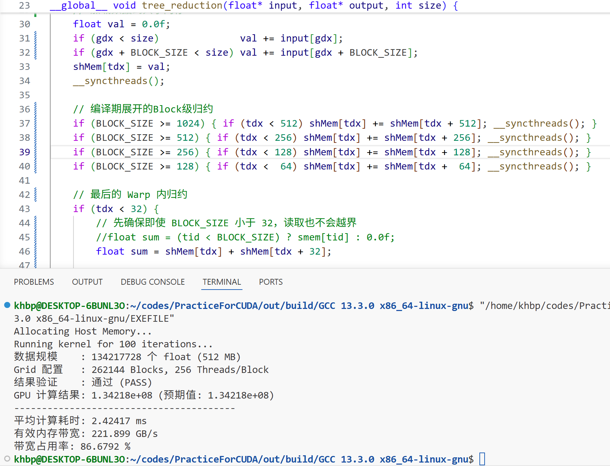

# 树形规约累加kernel


GPU Kernel 的性能上限由计算量和访存量共同决定，可以用 Roofline 模型来定位瓶颈

每个元素读取一次（1 次 load）

每次读取后做一次加法（1 次 FLOP）

算术强度 =1 FLOP / 4 Byte = 0.25 FLOP/Byte
（每个 float 元素 4 字节，对应 1 次加法）

这表明 Reduce 是典型的访存密集型（Memory-Bound）操作，优化的核心在于提升内存带宽利用率。


### 测试环境说明


所有代码使用 CUDA 13.2.78 编写，测试在 NVIDIA GeForce RTX 4060 Laptop GPU 上进行：

指标                数值

理论内存带宽         256 GB/s

L2 Cache 容量       24 MB

SM 数量             24

每 SM Shared Memory 128 KB


测试数据规模：2 ^ 27（128M 个 float，共 512 MB）


### version 0

朴素并行规约版本

#### 运行结果




### version 1


相较于version 0朴素并行规约：

- 一方面，改变线程映射关系——让**相邻的线程负责相邻步长对应的加法**，避免前几轮活跃线程大于32时的warp divergence；最后几轮由于规约相加时的活跃线程少于32，故存在warp divergence，但整体性能大幅提高。

- 另一方面，步长的变化改为由**半线程块维度**到1逐步递减，**使得活跃线程始终是连续的低编号线程**，避免下述的bank conflict

第 1 轮（step=1）：
tdx 0 访问 shMem[0]、shMem[1]；
tdx 16 访问 shMem[32]、shMem[33]。
shMem[0] 和 shMem[32] 都落在 Bank 0 → 2 路 Bank Conflict

第 2 轮（s=2）：
tdx 0 访问 shMem[0,2]；
tdx 8 访问 shMem[32,34]；
tdx 16 访问 shMem[64,66]；
tdx 24 访问 shMem[96,98]。
shMem[0]、shMem[32]、shMem[64]、shMem[96] 都在 Bank 0 → 4 路 Bank Conflict

第 3 轮（s=4）：8 路 Bank Conflict

以此类推…

#### scourse codes

```cuda
__global__ void tree_reduction(float* input, float* output, int size) {
    extern __shared__ float shMem[];
    int tdx = threadIdx.x;
    int gdx = blockDim.x * blockIdx.x + tdx;

    shMem[tdx] = gdx < size ? input[gdx] : 0.0f;
    __syncthreads();

    for (int step = blockDim.x / 2; step > 0; step /= 2) {
        if (tdx < step) { //仅需数组的前半部分累加
            shMem[tdx] += shMem[tdx + step];
        }
        __syncthreads(); //保证下一次运算读取的是更新后的数值
    }


    if (tdx == 0) {
        output[blockIdx.x] = shMem[0];
    }
}
```

#### 运行结果


显存占用率提高约15%

### version 2

- **在数据加载至共享内存的过程中进行一次相加**，使得block数量减半（整除情况下），降低GPU调度器压力，同时使得吞吐量翻倍

- 步长step <= 32时，只有一个warp工作，可直接展开对应的循环，**避免多余的__syncthreads()的开销**
注：volta架构后，warp内的32个线程不再同步锁步执行，必须显式调用__syncwarp()，同时无需用volatile修饰共享内存。并且，由于线程每次计算后会保留一份结果在寄存器中，减少了一定的共享内存访问的开销


#### scourse codes

```cuda
__device__ void reduceSumInLastWarp(float* shMem, int tdx) {
    shMem[tdx] += shMem[tdx + 32]; __syncwarp();
    shMem[tdx] += shMem[tdx + 16]; __syncwarp();
    shMem[tdx] += shMem[tdx + 8]; __syncwarp();
    shMem[tdx] += shMem[tdx + 4]; __syncwarp();
    shMem[tdx] += shMem[tdx + 2]; __syncwarp();
    shMem[tdx] += shMem[tdx + 1]; __syncwarp();

}

//grid应配置为(n + blockDim.x * 2 - 1) / (blockDim.x * 2)
//保证每个block均有不为0的数据且不丢失数据
__global__ void tree_reduction(float* input, float* output, int size) {
    extern __shared__ float shMem[];
    int tdx = threadIdx.x;
    int gdx = 2 * blockDim.x * blockIdx.x + tdx;

    float val = 0.0f;
    if (gdx < size) {
        val += input[gdx];
    }
    if (gdx + blockDim.x < size) {
        val += input[gdx];
    }
    shMem[tdx] = val;
    __syncthreads();

    //step <= 32 时退出循环
    for (int step = blockDim.x / 2; step > 32; step /= 2) {
        if (tdx < step) { //仅需数组的前半部分累加
            shMem[tdx] += shMem[tdx + step];
        }
        __syncthreads(); //保证下一次运算读取的是更新后的数值
    }

    //最后一个warp内的规约求和
    if (tdx < 32) {
        reduceSumInLastWarp(shMem, tdx);
    }


    if (tdx == 0) {
        output[blockIdx.x] = shMem[0];
    }

}
```


#### 运行结果


显存占用率提高约21%


### version 3

- 使用模板参数实现编译期的完全循环展开
对于不满足条件的分支，编译时不会生成机器码
不再存在条件判断、条件跳转等相关指令的开销
代码流程明确，故处理器可借助流水线、多发射等技术提高ILP

- 优化最后一个warp的规约流程，将数据存入线程寄存器，使用__shfl_down_sync()同步原语进行数据交换，避免访问共享内存的开销（寄存器的访问通常只需一个或几个时钟周期，而共享内存通常则需几十个时钟周期）

#### scr

```cuda
template <int BLOCK_SIZE>
__global__ void tree_reduction(float* input, float* output, int size) {
    extern __shared__ float shMem[];

    int tdx = threadIdx.x;
    int gdx = blockIdx.x * (BLOCK_SIZE * 2) + threadIdx.x;

    // 加载数据到共享内存
    float val = 0.0f;
    if (gdx < size)              val += input[gdx];
    if (gdx + BLOCK_SIZE < size) val += input[gdx + BLOCK_SIZE];
    shMem[tdx] = val;
    __syncthreads();

    // 编译期展开的Block级归约
    if (BLOCK_SIZE >= 1024) { if (tdx < 512) shMem[tdx] += shMem[tdx + 512]; __syncthreads(); }
    if (BLOCK_SIZE >= 512) { if (tdx < 256) shMem[tdx] += shMem[tdx + 256]; __syncthreads(); }
    if (BLOCK_SIZE >= 256) { if (tdx < 128) shMem[tdx] += shMem[tdx + 128]; __syncthreads(); }
    if (BLOCK_SIZE >= 128) { if (tdx <  64) shMem[tdx] += shMem[tdx +  64]; __syncthreads(); }

    // 最后的 Warp 内归约
    if (tdx < 32) {
        // 确保即使 BLOCK_SIZE 小于 32，读取也不会越界
        float sum = (tdx < BLOCK_SIZE) ? shMem[tdx] + shMem[tdx + 32] : 0.0f;
        
        sum += __shfl_down_sync(0xffffffff, sum, 16);
        sum += __shfl_down_sync(0xffffffff, sum, 8);
        sum += __shfl_down_sync(0xffffffff, sum, 4);
        sum += __shfl_down_sync(0xffffffff, sum, 2);
        sum += __shfl_down_sync(0xffffffff, sum, 1);

        // 由当前 Warp 的 0 号线程直接写回全局内存
        if (tdx == 0) output[blockIdx.x] = sum;
    }
}
```


#### yunxing



显存占用率提高约20%


### final version

- switch