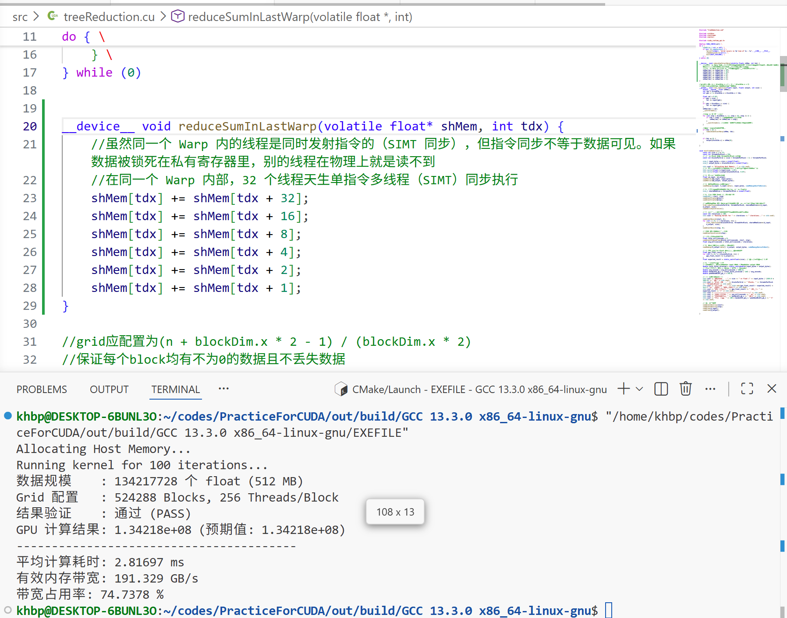

## 树形规约累加kernel


GPU Kernel 的性能上限由计算量和访存量共同决定，可以用 Roofline 模型来定位瓶颈

每个元素读取一次（1 次 load）

每次读取后做一次加法（1 次 FLOP）

算术强度 =1 FLOP / 4 Byte = 0.25 FLOP/Byte
（每个 float 元素 4 字节，对应 1 次加法）

这表明 Reduce 是典型的访存密集型（Memory-Bound）操作，优化的核心在于提升内存带宽利用率。


### 测试环境说明


所有代码使用 CUDA 13.2.78 编写，测试在 NVIDIA GeForce RTX 4060 Laptop GPU 上进行：

指标                数值

理论内存带宽         256 GB/s

L2 Cache 容量       24 MB

SM 数量             24

每 SM Shared Memory 128 KB


测试数据规模：2 ^ 27（128M 个 float，共 512 MB）


### version 0

朴素并行规约版本

#### 运行结果


### version 1


相较于version 0朴素并行规约：

- 一方面，改变线程映射关系——让**相邻的线程负责相邻步长对应的加法**，避免前几轮活跃线程大于32时的warp divergence；最后几轮由于规约相加时的活跃线程少于32，故存在warp divergence，但整体性能大幅提高。

- 另一方面，步长的变化改为由**半线程块维度**到1逐步递减，**使得活跃线程始终是连续的低编号线程**，避免下述的bank conflict

第 1 轮（step=1）：
tdx 0 访问 shMem[0]、shMem[1]；
tdx 16 访问 shMem[32]、shMem[33]。
shMem[0] 和 shMem[32] 都落在 Bank 0 → 2 路 Bank Conflict

第 2 轮（s=2）：
tdx 0 访问 shMem[0,2]；
tdx 8 访问 shMem[32,34]；
tdx 16 访问 shMem[64,66]；
tdx 24 访问 shMem[96,98]。
shMem[0]、shMem[32]、shMem[64]、shMem[96] 都在 Bank 0 → 4 路 Bank Conflict

第 3 轮（s=4）：8 路 Bank Conflict

以此类推…

#### scourse codes

```cuda
__global__ void tree_reduction(float* input, float* output, int size) {
    extern __shared__ float shMem[];
    int tdx = threadIdx.x;
    int gdx = blockDim.x * blockIdx.x + tdx;

    shMem[tdx] = gdx < size ? input[gdx] : 0.0f;
    __syncthreads();

    for (int step = blockDim.x / 2; step > 0; step /= 2) {
        if (tdx < step) { //仅需数组的前半部分累加
            shMem[tdx] += shMem[tdx + step];
        }
        __syncthreads(); //保证下一次运算读取的是更新后的数值
    }


    if (tdx == 0) {
        output[blockIdx.x] = shMem[0];
    }
}
```

#### 运行结果


显存占用率提高约15%

### version 2

- 在数据加载至共享内存的过程中进行一次相加，使得block数量减半（整除情况下），降低GPU调度器压力。

- 步长step <= 32时，由于同一warp内线程的操作本身同步，无需调用__syncthreads()，故单独进行规约




### version 3

- 使用__shfl_down_sync()同步原语代替外部函数，使同一warp内的线程直接访问对应的其他线程的寄存器，避免了访问共享内存的开销（寄存器的访问通常只需一个或几个时钟周期，而共享内存通常则需几十个时钟周期）