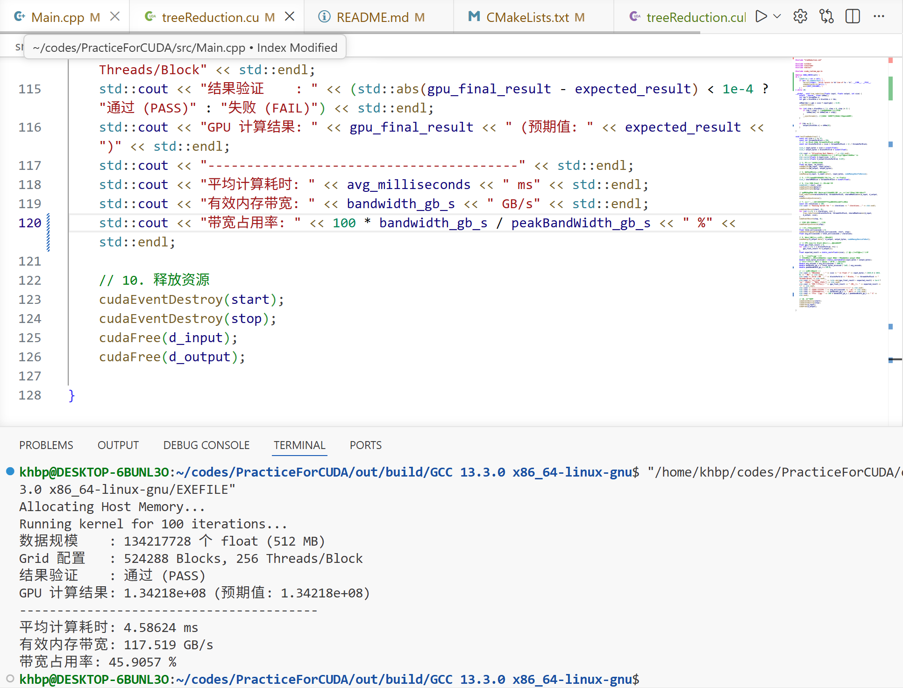

# SGEMM
# tensor core

***GEMM 优化的本质是用寄存器和共享内存（Shared Memory）挡住对全局内存（Global Memory）的访问。*** 

C = A @ B

$A \in \mathbb{R}^{M \times K}$

$B \in \mathbb{R}^{K \times N}$

$C \in \mathbb{R}^{M \times N}$

### 性能指标

不考虑落地工程中的端到端耗时与延迟、鲁棒性、每瓦特吞吐量等因素，算力利用率、带宽利用率是以结果为导向的衡量指标；算术强度、全局内存访问率、L1L2缓存命中率是以过程为导向的衡量指标。

### tiling

分块思想贯穿始终

***每下降一个内存层次，就对应线程层次的一层分块。***

## Naive版本

SGEMM 计算强度I =

2 * M * N * K / 4 * 2 * M * N * K = 0.25FLOPs/Byte

## version 1

#include <cuda_runtime_api.h>

template <int BM, int BN, int BK, int BLOCK_SIZE>
__global__ void sgemm_block_tiling(float* A, float* B, float* C,
                                   int M, int K, int N) {
    __shared__ float As[BM][BK];
    __shared__ float Bs[BK][BN];

    int r0 = blockIdx.y * BM;//
    int c0 = blockIdx.x * BN;//
    int tid = threadIdx.x;

    // 加载 tileA 时的线程重排
    constexpr int A_BLOCK_X = BK;  // = 8
    constexpr int A_BLOCK_Y = BLOCK_SIZE / A_BLOCK_X;  // = 32
    int a_thread_x = tid % A_BLOCK_X; // 0 ~ 7
    int a_thread_y = tid / A_BLOCK_X; // 0 ~ 31

    // 加载 tileB 时的线程重排
    constexpr int B_BLOCK_X = 32;
    constexpr int B_BLOCK_Y = BLOCK_SIZE / B_BLOCK_X;  // = 8
    int b_thread_x = tid % B_BLOCK_X;
    int b_thread_y = tid / B_BLOCK_X;

    // 计算 tileC 、写入C 时的线程排布（16×16）
    constexpr int C_BLOCK_X = 16;
    constexpr int C_BLOCK_Y = BLOCK_SIZE / C_BLOCK_X;  // = 16
    int c_thread_x = tid % C_BLOCK_X; // 0 ~ 15
    int c_thread_y = tid / C_BLOCK_X; // 0 ~ 15

    // 16 * 16 threads 负责 128 * 128 个元素
    // 每个线程负责 Tm×Tn 个输出元素
    constexpr int Tm = BM / C_BLOCK_Y;  // = 8 跨步覆盖128行 由BM、BLOCK_SIZE决定
    constexpr int Tn = BN / C_BLOCK_X;  // = 8 跨步覆盖128列 由BN决定
    float Ct[Tm][Tn] = {0.0f};

    // K-Loop
    //一次循环对应
    for (int k = 0; k < K; k += BK) {

        //r0用于A、C矩阵行索引，c0用于B、C矩阵列索引
        //A矩阵列索引、B矩阵行索引借助K-Loop中的循环变量k

        // 将tileA数据载入SMEM（使用跨步循环覆盖 BM 行）
        #pragma unroll
        for (int i = a_thread_y; i < BM; i += A_BLOCK_Y) { //BM 128
            // i            128 * 8    32 * 8
            // 0 32 64 96
            // 1 33 65 97
            // 2 34 66 98
            // ...
            // 31 63 95 127
            // tile A  8 * 32  256
            int r = r0 + i, c = k + a_thread_x; // 128 128
            //同一block内，具体一次K维度的循环中，所有thread的r0一定、k一定。
            As[i][a_thread_x] = (r < M && c < K) ? A[r * K + c] : 0.0f; //所有线程均运行该行代码，将HBM中的数据存入各自对应的block的SMEM
        }

        // 协作加载 tileB（使用跨步循环覆盖 BN 列）
        #pragma unroll
        for (int j = b_thread_x; j < BN; j += B_BLOCK_X) {
            int r = k + b_thread_y, c = c0 + j;
            //同一block内，具体一次K维度的循环中，所有thread的c0一定、k一定
            Bs[b_thread_y][j] = (r < K && c < N) ? B[r * N + c] : 0.0f;
        }

        //确保SMEM数据为本轮循环的数据
        __syncthreads();

        // 外积方式计算 As × Bs
        // 1个thread 64 个元素
        #pragma unroll
        for (int p = 0; p < BK; p++) {
            for (int i = 0; i < Tm; i++) {
                int row = c_thread_y + i * C_BLOCK_Y; //0~120
                //进入循环，16 * 16 个线程中，同一行线程计算出相同row，但不同于其他行
                for (int j = 0; j < Tn; j++) {
                    int col = c_thread_x + j * C_BLOCK_X; //0~120 
                    //同一列线程计算出相同col，但不同于其他列
                    Ct[i][j] += As[row][p] * Bs[p][col];
                    //8*8       128*8        8*128
                    //每一个线程负责一对As中一个元素、Bs中一个元素的FMA运算
                }
            }
        }
    
        __syncthreads(); //避免在本轮循环计算完成前，SMEM被下一轮数据覆盖
    }

    // 写回结果
    for (int i = 0; i < Tm; i++) {
        int r = r0 + c_thread_y + i * C_BLOCK_Y;
        for (int j = 0; j < Tn; j++) {
            int c = c0 + c_thread_x + j * C_BLOCK_X;
            if (r < M && c < N) C[r * N + c] = Ct[i][j];
        }
    }
}

**thread block级tiling + thread级tiling**

*block级tiling：减少对HBM的访问次数*

- 矩阵C划分为BM * BN的分块，每个 Thread Block 负责一块。相较于naive版本的从Global memory反复取值、进行FMA计算，v1先将Global memory中数据载入SMEM，再从SMEM中反复取值、进行FMA运算。

*thread级tiling实现了寄存器复用*

- 将tileA（tileB同理）分块，每个线程通过循环运输**跨A_BLOCK_Y步等距**的*BM / A_BLOCK_Y下取整*个数据

- 将tileC分为Tm * Tn个格，一个线程跨步计算每个格中的一个元素，共Tm * Tn个元素。不同于1线程1数据+内积矩乘，采用1线程多数据（扩大tileC尺寸）+外积矩乘，并通过寄存器级缓存实现寄存器复用：

借助编译器优化，1个线程加载Tm + TN个数据，完成Tm * Tn次乘加运算FMA，提高了访存比

为什么不叫tile级分块？？？

SGEMM 算数强度I =

2 * BM * BN * BK / 4 * (BM * BK + BK * BN)

BM = BN = 64  ->  I == 16 FLOPS/Byte
BM = BN = 128  ->  I == 32 FLOPS/Byte

BK = 8
过小 -> K-Loop循环次数过多 -> 块级同步次数过多
过大 -> SMEM容量占用过多或不足

BLOCK_SIZE = 256

GPU硬件
      │
      ▼
Roofline决定需要AI
      │
      ▼
确定BM、BN
      │
      ▼
Shared Memory容量
      │
      ▼
确定BK
      │
      ▼
每线程寄存器预算
      │
      ▼
确定BLOCK_SIZE
      │
      ▼
得到Tm、Tn

二维grid 一维block256

#### 线程重排

一个tileA，128 * 8，1024个元素，在全局内存中为*行优先存储（Row-Major）*，即同行相邻列的元素在内存中是连续的，同列相邻行的元素则相隔K个距离。由一维线程块负责，包含256个thread，重排为32 * 8，使用跨步循环实现一个block覆盖tileA完整范围；

一个tileB，8 * 128，1024个元素，由一维线程块负责，包含256个thread，重排为8 * 32，使用跨步循环实现一个block覆盖tileB完整范围；

用 a_thread_x/y 和 b_thread_x/y 的线程重排索引，目的是实现合并内存访问（Coalesced Access）

一个tileC，128 * 128 个元素，由一维线程块负责，包含256个thread，重排为16 * 16，使用跨步循环实现一个block覆盖tileC完整范围；

#### 线程与tile的映射
一个block负责一排As和一列Bs的矩乘，
维度为K、步长为BK的循环中，具体一次工作流的拆解：

1. 全局内存数据载入共享内存数组As、Bs阶段：

载入As时，每个线程以A_BLOCK_Y为步长，跨步循环BM/A_BLOCK_Y（上取整）次，横跨线程对应的As数组的128行。  
载入Bs时，每个线程以B_BLOCK_X为步长，跨步循环BN/B_BLOCK_X（上取整）次，横跨线程对应的Bs数组的128列。  
每个block中所有线程同步至完成载入的阶段，此时As、Bs分别包含一个tileA、一个tileB的数据。

*进行block级别同步，是为避免部分线程载入数据仍未完成，就开始使用上次的残留数据并行计算的错误。*

2.并行计算

每个线程在Tn、Tm、BK维度的循环过程中，于Ct中累加结果，循环结束后，Ct包含As中**跨C_BLOCK_Y步等距**的多行与Bs中**跨C_BLOCK_X步等距**的多列之间的矩乘结果，它是BK维度上的，并不是对应K维度的最终可输出结果；  
每个block中所有线程同步至各自Ct计算完毕的阶段，此时每个tileA、B均完成计算，结果被浓缩进入每个线程的Ct数组； 

*进行block级别同步，是为保证先完成本次tileA、B的计算，再进行下一个tileA、B的计算，否则会出现将下一个tileA、B的数据计算结果存入本次Ct的错误*  

继续维度为K、粒度为BK的遍历；  
外层K-LOOP结束后，每个线程负责的多行多列（跨步C_BLOCK_X、C_BLOCK_Y）的计算在K维度上完成；此时Ct为该thread负责的多排多列（跨步C_BLOCK_X、C_BLOCK_Y）的最终矩乘结果。

3. 结果返回
kernel 执行结束时所有线程会自动在块内隐式同步退出

#### 写回时的分块策略

采用以16\*16为大小，分成8\*8个的策略，即一个线程跨步覆盖tileC，相邻线程合并访问相邻地址，内存事务少；  
若以8\*8为大小，分成16\*16个，warp内所有相邻线程均访问不相邻的地址，读写效率极低。

#### 外积矩阵乘法

相较于内积法，GEMM变为多个秩-1矩阵的累加，便于向量化指令、并行计算

## version 2

template <int BM, int BN, int BK, int TM, int TN>
__global__ void sgemm_thread_tiling(const float *A, const float *B, float *C,
                                    int M, int N, int K)
{
    __shared__ float As[BM][BK];
    __shared__ float Bs[BK][BN];

    int tid = threadIdx.x;

    // 每个线程在 C 中负责 TM×TN 的子块
    const int C_BLOCK_X = BN / TN;
    const int C_BLOCK_Y = BM / TM;
    int c_thread_x = tid / (BN / TN);
    int c_thread_y = tid / (BM / TM);
    int thread_row = c_thread_x * TM;
    int thread_col = c_thread_y * TN;

    // 寄存器存储
    float a_frag[TM];
    float b_frag[TN];
    float c_frag[TM][TN] = {0.0f};

    int by = blockIdx.y, bx = blockIdx.x;

    for (int bk = 0; bk < K; bk += BK)
    {
        // 协作加载 A、B 到 Shared Memory（省略边界检查）
        load_tile_A(A, As, by, bk, tid, M, K);
        load_tile_B(B, Bs, bx, bk, tid, K, N);
        __syncthreads();

        // 外积累加
        for (int k = 0; k < BK; k++)
        {
            // 从 Shared Memory 加载到寄存器
            for (int i = 0; i < TM; i++)
            {
                a_frag[i] = As[thread_row + i][k];
                // 同行的16个线程计算出的thread_row相同，执行相同操作，即16个线程读取As中的同一个地方、再将数据载入a_frag数组
                // 每一行的16个线程共享一个a_frag数组，一个block有8个a_frag数组
            }
            for (int j = 0; j < TN; j++)
            {
                b_frag[j] = Bs[k][thread_col + j];
                // 同列的16个线程计算出的thread_col相同，执行相同操作，即读取Bs中的同一个地方、再将数据载入b_frag数组
                // 每一列的16个线程共享一个b_frag数组，一个block有8个b_frag数组
            }
            // 寄存器上做外积
            for (int i = 0; i < TM; i++)
                for (int j = 0; j < TN; j++)
                    c_frag[i][j] += a_frag[i] * b_frag[j];
        }
        __syncthreads();
    }

    // 写回 Global Memory
    for (int i = 0; i < TM; i++)
    {
        int r = by * BM + i * C_BLOCK_Y + c_thread_y;
        for (int j = 0; j < TN; j++)
        {
            int c = bx * BN + j * C_BLOCK_X + c_thread_x;
            if (r < M && c < N)
                C[r * N + c] = c_frag[i][j];
        }
    }
}

v1中，外积方式计算 Ct[i][j] += As[row][p] * Bs[p][col] 时，编译器可能会为 As[row][p] 的重复读取做一定优化，但远不如v2中手工寄存器分块可控且高效

将加载部分与计算部分分离开。并行加载至寄存器，既加速数据载入，又加速计算部分；计算部分仍串行进行，但由于数据从寄存器加载，所以速度更快。

v1计算过程：  
As数组中待处理的16个元素、Bs数组中待处理的16个元素进行外积运算，该过程以循环方式串行执行，直到As、Bs计算结束；
v2：
16*16个线程并行执行，将As、Bs中待处理的16个元素（它们是跨步等距的）运输至各自线程私有的寄存器数组（此过程存在同一行/列的线程执行相同事务的情况，或者说这些线程共享同一个register file）；依次循环TM、Tn次，将As、Bs的完整一列/行各自寄存器数组，接着串行计算。  
内层循环沿BK维度遍历时，每次从共享内存加载TM个A元素和TN个B元素到寄存器a_frag、b_frag，并在寄存器上做外积累加；沿BK维度、步长为1的遍历结束后，该tileA、B的计算结束，block级同步结束后，进行下一组tileA、B的计算。

v2相较于v1，写回结果时采用了不同分块策略，

## version 3
block 级 tiling + warp 级 tiling + 线程级寄存器 tiling

优化共享内存分块载入寄存器数组部分。核心为通过 warp 内 shuffle 让一条线程加载的数据被同 warp 的其它线程复用。

具体实现：  
坐标系从 “thread 在 block 内的位置”换成了“warp + lane 在 block 内的位置”；  
从warp尺寸2 * 16、block内全部线程进行读操作  
换成了  
warp尺寸4 * 8、block内**仅warp内lane的x、y方向索引为0**的*O(a * TM + b * TN)*个线程进行读操作

!!!
彻底消除 divergence.

？？？
TM TN x y 在哪一维度列不等式？

存在的warp divergence是否大幅影响性能？
写回过程为合并访问？